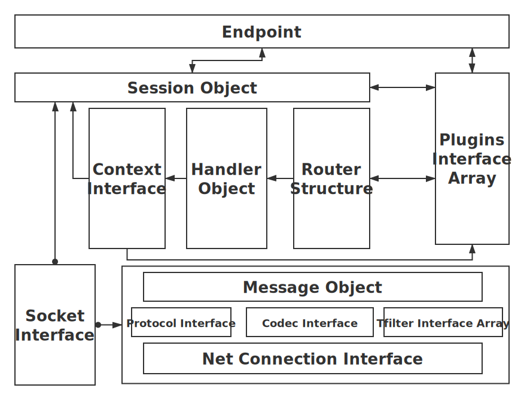

# 架构图

通过以上架构图，可以清晰的展示`drpc`框架的各个组件的关系。

## 名词解释

### `Endpoint`

drpc框架的主对象，为`server`和`client`提供相同的`API`封装。

### `Session Object`

* 建立链接后的会话。

1. client链接到server端，在client对象对应的`Endpoint`中生成session，所有的操作都是通过这个session对象来完成。
2. server端接收到client端的链接，在server对象对应的`Endpoint`中生成session，所有的操作都是通过这个session对象来完成。

### `Plugins Interface Array`

插件是通过各种事件的组合加上独特的逻辑，形成特殊的功能。
这些功能可以复用在不同的`Endpoint`上。

### `Router Structure`

* 路由对象，生成不同的路由名对应到指定的handler方法。

### `Handler Object`

通过路由注册的处理方法，客户端请求过来后，通过路由名称，路由到对应的方法，执行相应的业务逻辑。

### `Context Interface`

处理业务逻辑的上下文对象。每次请求中是独立的。

### `Socket Interface`

drpc支持使用不同的网络协议来通信，`Socket`对象就是这些网络协议的封装。
目前支持一些网络类型：

* tcp
* tcp4
* tcp6
* unix
* unixpacket

### `Message Object`

每次请求，都抽象成一条消息。

### `Protocol Interface`

消息在网络上传输，需要遵循一定的格式，`Protocol`就是这个格式的抽象。

目前支持以下协议：
* rawproto - 默认的高性能二进制协议
* jsonproto - JSON 消息协议
* httproto - HTTP 消息协议

### `Codec Interface`

网络上传输需要指定的格式，使用`Protocol`,
那么消息内容需要自定义格式格式怎么办，用`Codec`.

### `Tfilter Interface Array`

消息内容在传输的之前，可以对消息内容做一些个性化的设置，比如加密解密，比如签名，`Tfilter`提供了这个能力。
可以在业务不可感知的情况下，进行这些工作。

### `Net Connection Interface`

最底层的网络层，这个层面提供了各种特殊协议的支持，比如`kcp`,`quic`等等。
