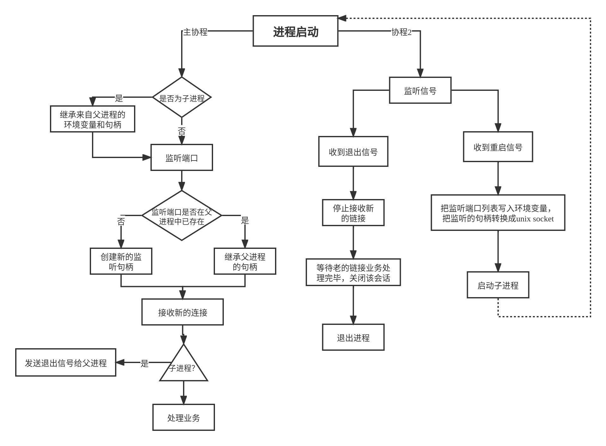

# 平滑重启

## 为什么要平滑重启

在生产环境中发布新版本，一直是一个比较头痛的事情，粗暴的解决方案就是直接重启。
但是直接重启会产生很多问题，特别是在存在大量用户的情况下，问题也会被放大。
不可避免的会出现以下问题：

1. 未处理完的请求，被强制中断，数据一致性被破坏。
2. 在老的服务关闭，新的服务正在启动的期间，请求得不到响应，造成服务中断。

以上两种情况，在使用php的时候，一般是不存在的，但是使用golang，这两个问题就必须自己解决了。

处理发布问题常用的有几种解决方案.

1. 使用网关进行流量切换，把新的流量请求切换到一台正常服务器上，等需要升级的服务没有流量后在重启。
2. 使用`kubernetes`或者其他云平台，进行发布，本质上也是切流量。
3. 程序本身解决流量切换完成平滑重启。

## 什么是平滑重启

进程在不关闭其监听的端口情况下，进行重启，并且在重启的整个过程中保证所有的请求都被正确的处理。

平滑重启有两种实现方式，
1. 父子进程模式。
2. Master - Worker进程模式。


`DRPC`实现了以上两种模式，大家可以根据需要自行选择。


### 父子进程模式重启步骤
步骤如下：

1. 新版本的进程发布到线上，并且替换需要执行的进程文件
2. 发送重启信号给到正在运行的进程。
3. 原进程收到信号后，把当前进程监听的`addr`列表赋值给环境变量，然后fork出一个子进程，并使用被替换的可执行进程文件启动。
4. 子进程通过环境变量获得父进程要监听的端口列表，继承父进程所监听的端口。
5. 子进程完成初始化以后，开始接收新的请求。
6. 父进程收到子进程已启动成功的信号后，开始关闭端口监听，并且等待正在处理的请求处理完毕。
7. 所有请求处理完毕，父进程退出。至此，完成了平滑重启。

流程图如下：
    

> ps: 父子进程模式不能在`supervisor`下使用。


### Master-Worker进程模式重启步骤

步骤如下：
1. `主进程`启动，监听指定的地址，并把`主进程`监听的`addr`列表赋值给环境变量，并fork出一个`子进程A`。
2. `子进程A`通过环境变量获得`主进程`要监听的端口列表，继承`主进程`所监听的端口，完成初始化以后，，开始接收请求。
3. 新版本的进程发布到线上，并且替换需要执行的进程文件
4. 发送重启信号给到正在运行的主进程。
5. `主进程`收到信号后，把`主进程`监听的`addr`列表赋值给环境变量，然后fork出一个`子进程B`，并使用被替换的可执行进程文件启动。
6. `子进程B`通过环境变量获得`主进程`要监听的端口列表，继承`主进程`所监听的端口。
7. `子进程B`完成初始化以后，开始接收新的请求。
8. `主进程`发送退出信号给`子进程A`。
9. 所有请求处理完毕，`子进程A`。至此，完成了平滑重启。

流程图如下：
    

> Master-Worker进程模式需要启动两个进程。

## 使用方式

### 父子进程模式的使用方式

```go
// server.go
package main

import (
	"github.com/osgochina/dmicro/drpc"
	"github.com/osgochina/dmicro/logger"
	"github.com/osgochina/dmicro/utils/graceful"
	"time"
)

func main() {
	//开启信号监听，注意，必须开启这个信号监听，才能平滑重启
	go graceful.GraceSignal()

	// 启动服务
	svr := drpc.NewEndpoint(drpc.EndpointConfig{
		CountTime:   true,
		LocalIP:     "127.0.0.1",
		ListenPort:  9091,
		PrintDetail: true,
	})

	// 注册处理方法
	svr.RouteCall(new(Grace))
	logger.Warning(svr.ListenAndServe())
	time.Sleep(30 * time.Second)

}

type Grace struct {
	drpc.CallCtx
}

func (m *Grace) Sleep(arg *int) (string, *drpc.Status) {
	logger.Infof("sleep %d", *arg)
	if *arg > 0 {
		sleep := *arg
		time.Sleep(time.Duration(sleep) * time.Second)
	}
	// response
	return "sleep", nil
}

```

### Master-Worker进程模式的使用方式

```go
// server.go
package main

import (
	"github.com/osgochina/dmicro/drpc"
	"github.com/osgochina/dmicro/logger"
	"github.com/osgochina/dmicro/utils/graceful"
	"time"
)

func main() {

	// 使用master worker 进程模型实现平滑重启
	// 必须要预先注册指定的端口，非注册的端口提供的服务无法平滑重启
	err := graceful.SetInheritListener([]graceful.InheritAddr{{Network: "tcp", Host: "127.0.0.1", Port: "9091"}})
	if err != nil {
		logger.Error(err)
		return
	}
	// 启动服务
	svr := drpc.NewEndpoint(drpc.EndpointConfig{
		CountTime:   true,
		LocalIP:     "127.0.0.1",
		ListenPort:  9091,
		PrintDetail: true,
	})
	//开启信号监听，注意，必须开启这个信号监听，才能平滑重启
	go graceful.GraceSignal()
	// 注册处理方法
	svr.RouteCall(new(Grace))
	logger.Warning(svr.ListenAndServe())
	time.Sleep(30 * time.Second)

}

type Grace struct {
	drpc.CallCtx
}

func (m *Grace) Sleep(arg *int) (string, *drpc.Status) {
	logger.Infof("sleep %d", *arg)
	if *arg > 0 {
		sleep := *arg
		time.Sleep(time.Duration(sleep) * time.Second)
	}
	// response
	return "sleep", nil
}

```


### 客户端的使用方式

```go
package main

import (
	"fmt"
	"github.com/osgochina/dmicro/drpc"
	"github.com/osgochina/dmicro/logger"
	"time"
)

func main() {

	cli := drpc.NewEndpoint(drpc.EndpointConfig{PrintDetail: true, RedialTimes: 1, RedialInterval: time.Second})
	defer cli.Close()

	sess, stat := cli.Dial("127.0.0.1:9091")
	if !stat.OK() {
		logger.Fatalf("%v", stat)
	}
	n := 1
	for {
		var result string
		stat = sess.Call("/grace/sleep",
			5,
			&result,
		).Status()
		if !stat.OK() {
			logger.Error(stat.Cause())
		}
		fmt.Printf("%d.%s\n", n, result)
		time.Sleep(1 * time.Second)
	}

}
```

### 运行

开启第一个窗口
```shell
$ go build server.go
$ ./server.go
```
开启第二个窗口

```shell
$ go build client.go
$ ./client.go
```

现在服务端和客户端已经开启完毕，它们之间正在进行通讯，如果此时我需要升级`server`端，需要如何做？

开启第三个窗口：

```shell
$ ps aux|grep "./server"
# 向服务发送重启信号
$ kill -USR2 pid
# 如果你嫌麻烦，也可以一步到位
ps aux|grep "./server"|grep -v grep|awk '{print $2}'|xargs kill -USR2
```
